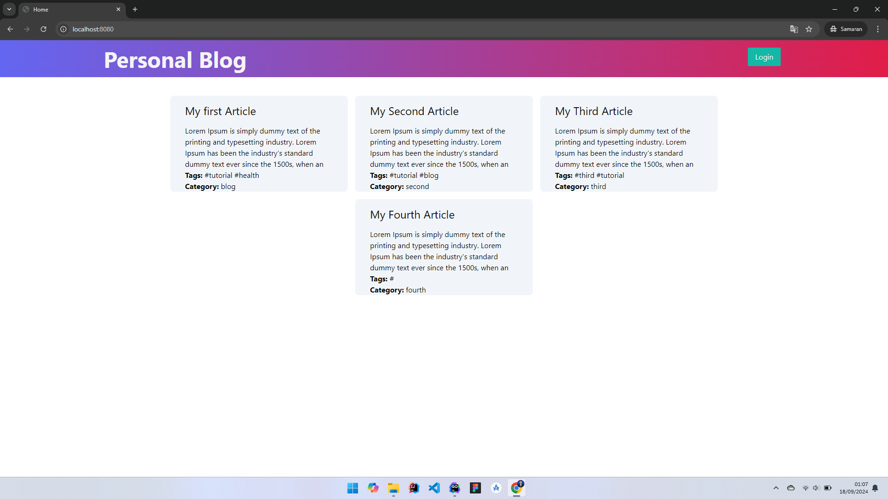
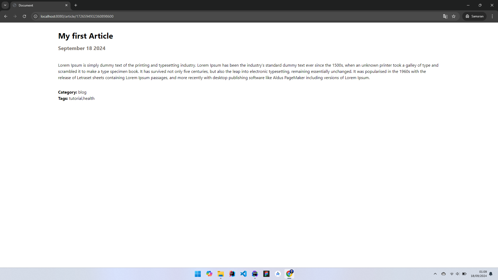
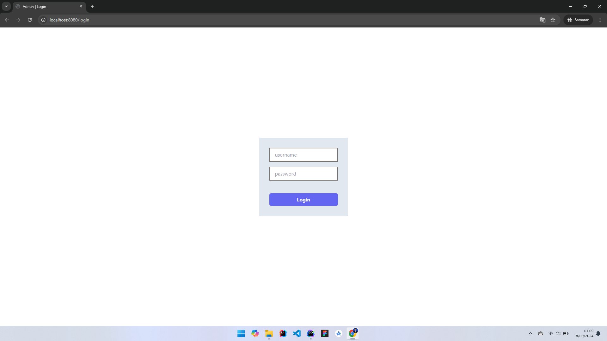
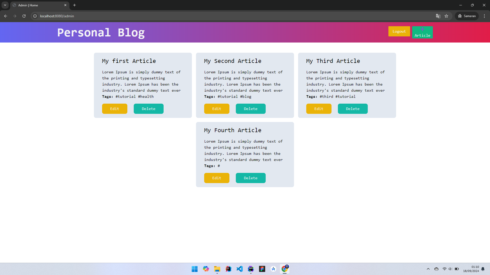
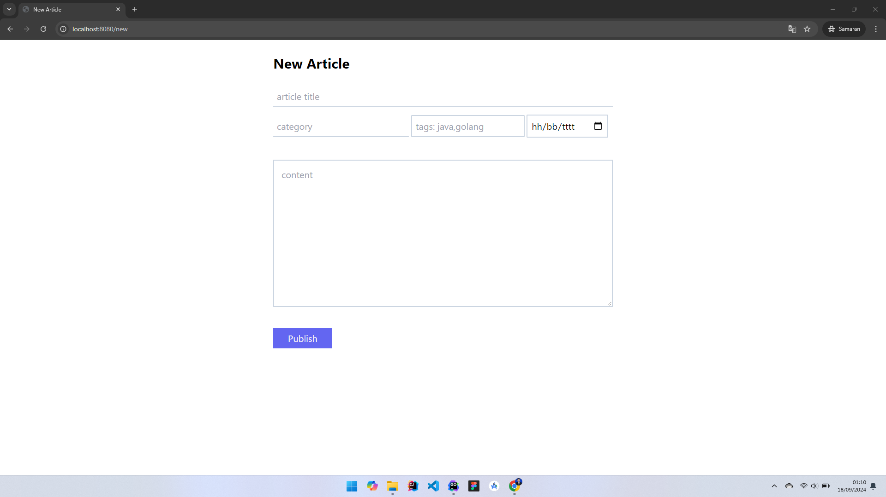
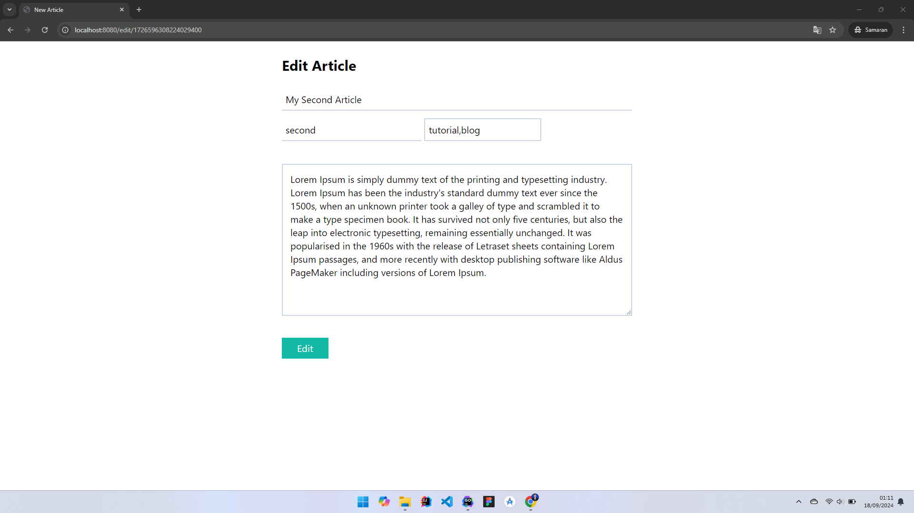

# Personal Blog #
Sample solution for the [Personal Blog]() challenge from [roadmap.sh](https://roadmap.sh/).
This is project blog, the blog will have two sections: a guest section and an admin section.

## Features
1. Guest section  
   - Home page: This page will display the list of articles published on the blog
   - Article page: This page will display the content of the article along with the date of publication
2. Admin section  
   - Dashboard: This page will display the list of articles published on the blog along with the option to add a new article, edit an existing article, or delete an article.
   - Add article page: This page will contain a form to add a new article. The form will have fields like title, content, and date of publication.
   - Edit article page: This page will contain a form to edit an existing article. The form will have fields like title, content, and date of publication.

## Installation
1. Install [Go language](https://go.dev), setup system env variable & check installation ``go version``
2. Download **ZIP** file or use ``git clone https://github.com/mrizkisaputra/backend-projects.git``
3. Open terminal, navigate to directory project **personal-blog**
4. Run ``go run main.go``
5. Open browser ``localhost:8080``

## Result

